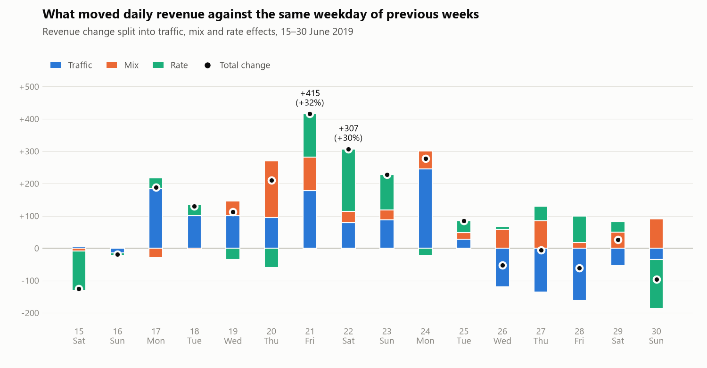
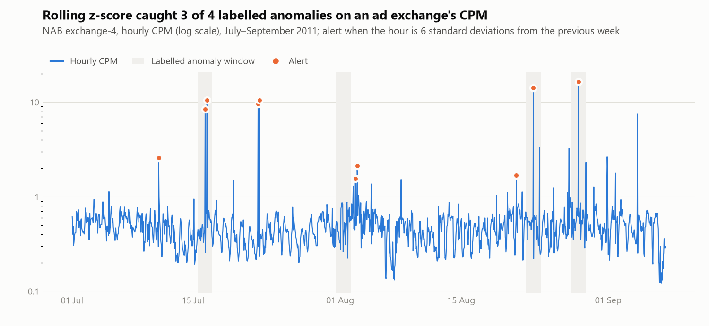
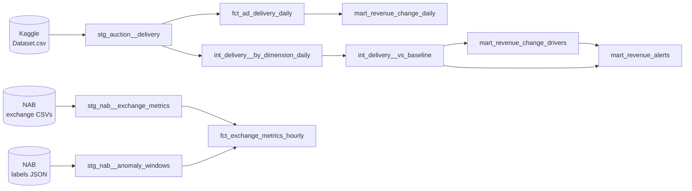

# Ad Revenue Analytics: Data Model and Anomaly Detection

A portfolio project that models a publisher's ad revenue in dbt, explains what drove each change in revenue, and evaluates anomaly detectors against labelled data. It is inspired by real-world ad monetisation analytics and uses only public data.

## Result

<picture>
  <source media="(prefers-color-scheme: dark)" srcset="output/revenue_change_split_dark.png">
  
</picture>

The two largest revenue changes of the month, Friday 21 and Saturday 22 June, came from two things at once:

| | Fri 21 June | Sat 22 June |
|---|---:|---:|
| **Revenue against the same weekdays** | **+415 (+32%)** | **+307 (+30%)** |
| Traffic: more impressions | +179 | +79 |
| Mix: impressions moving to better-paid inventory | +103 | +35 |
| Rate: the same inventory paid more | +133 | +192 |

- **A traffic surge on an expensive site.** Site 345 (eCPM 2.55 against 2.07 overall) had 2.1× its usual Friday traffic, which shows up as both traffic and mix.
- **The main buyer paid more.** Advertiser 79, 73% of revenue, raised its eCPM by ~20% on 7 of its 8 large sites, on every main device type and in every large geo. A change that broad points to the demand side rather than to a floor price or placement change on the publisher's side.
- Both faded by 23–24 June. Revenue-level data cannot tell *why* the buyer paid more. The walkthrough with every query is in the [notebook](notebooks/anomaly_detection.ipynb).

### Which anomaly detector to trust

<picture>
  <source media="(prefers-color-scheme: dark)" srcset="output/detection_example_dark.png">
  
</picture>

Four causal detectors were scored against 14 hand-labelled anomaly windows on real ad exchange CPC/CPM series, with parameters chosen leaving one exchange out:

| Detector (held-out) | Precision | Recall | F1 |
|---|---:|---:|---:|
| Robust z-score (median / MAD) | 0.50 | 0.64 | 0.56 |
| Rolling z-score | 0.48 | 0.57 | 0.52 |
| Level shift | 0.50 | 0.43 | 0.46 |
| Seasonal z-score (same hour) | 0.37 | 0.57 | 0.45 |

- About 10% of timestamps fall inside labelled anomaly windows, so the observed precision (37–50%) is well above a simple point-level random baseline.
- **The ranking is not robust enough to treat the differences as meaningful.** One window is 7 points of recall, and the ranking flips when the grid moves by one step; with 14 windows, no confidence intervals were attempted. The rolling z-score is the stable choice: the same one-week window wins in every fold, while the robust z-score needs thresholds of 15–20 on these heavy-tailed series.
- **None of them catches the slow 15–20% dips of exchange-2** (0 of 3 windows): detectors tuned on spikes set thresholds far above a drift, and unlabelled dips of the same size happen nearby. Spikes and drifts need different detectors.

### Alerts that read as events

> **Alert thresholds are calibrated retrospectively on the available month and are not a causal production backtest.** The "usual error" behind each threshold is measured over all of 15–30 June, including days after the alert and the anomalous days themselves. With one month of data this is a retrospective scan; a live monitor would estimate the error from past days only.

The publisher data has no labels, so the detector lessons set the design of `mart_revenue_alerts`: one rule per kind of event (the total moving, a material slice stopping, a large slice moving), thresholds at twice the baseline's usual error for each dimension, a materiality floor and a 7-day cooldown. A plain "30% off and at least 1% of the day" threshold raises 205 alerts over 15–30 June, mostly on ad units; these rules raise 20 alerts on 6 days, each a readable event:

| Day | Event | Explained by |
|---|---|---|
| Sat 15 June | Channel 21 stopped delivering (one buyer, one ad unit; ~1.5% of daily revenue) | volume |
| Mon 17 June | Traffic surge on site 346 (+79%) | volume |
| Thu 20 June | Traffic surge on site 351 (+48%) | volume |
| Fri 21 June | Total revenue +32%: the main buyer paying more, plus the site 345 surge | price, volume on site 345 |
| Sat 22 June | The tail of 21 June: device 3 and channel 4 | price / volume |
| Mon 24 June | Advertiser 16 +50% | volume |

Each alert row carries its volume and price effects and a one-line explanation, e.g. *"site_id 345: revenue +146% against the same weekdays (+255, 20% of the day), mostly volume (impressions)"*. Channel 21 actually stopped on 12 June; the alert comes on 15 June, the first day with two weeks of baseline history.

## Context

I'm a Senior Data Analyst working on advertising monetisation. Two questions come up every morning in this job: *what moved revenue yesterday?* and *is this alert real or noise?* This project rebuilds the analytics behind both answers end-to-end on public data, so the methodology and code can be shared safely.

## What it does

| Step | Logic |
|---|---|
| Data model | dbt project on DuckDB: staging → intermediate → marts, with descriptions for every model. |
| Data quality | Generic and singular tests guard the grain, value ranges and reconciliations between layers. Known quirks of the source are `warn`-level tests, so they are reported without breaking the build. |
| Revenue change drivers | Each day is compared with the same weekday of the previous 2–3 weeks. The change is split into volume and price effects for every slice (site, ad unit, channel, advertiser, geo, device, OS), and into traffic, mix and rate effects for the day as a whole. |
| Anomaly detection | Four causal detectors (rolling, robust and seasonal z-scores, level shift) in a unit-tested Python module, scored with precision and recall against hand-labelled anomaly windows of real ad exchange CPC/CPM series. Parameters are chosen leaving one exchange out. |
| Alerts | Daily alerts on the publisher data in dbt: three rules, thresholds from the baseline's noise, materiality and a cooldown; every alert explained by its volume and price effects. |

### Volume and price

Revenue = impressions × eCPM / 1000, so the change against the baseline splits into:

- **volume effect** = Δ impressions × average eCPM of the two periods / 1000
- **price effect** = Δ eCPM × average impressions of the two periods / 1000

This midpoint split adds up to the revenue change exactly, with no interaction term to explain away. A slice that appears or disappears is all volume; revenue reported without impressions is kept separately as `unattributed_effect`. The formulas live in one set of dbt macros used by both revenue change marts, and a unit test covers all three cases.

### Traffic, mix and rate

For a whole day, "price" hides two different stories: the same inventory being paid more, or traffic moving to inventory that is paid more. `mart_revenue_change_daily` tells them apart by splitting the change at the finest grain (site × ad unit × ad type × channel × advertiser × geo × device × OS):

- **traffic** = Δ total impressions × average total eCPM / 1000
- **mix** = the slices' volume effects minus traffic: impressions moving between slices with different eCPM
- **rate** = the slices' price effects: the same slice paid differently

Unit tests pin down both ends: traffic moving to a better-paid slice with no price change is all mix, and a single slice that grows and is repriced has no mix.

### Baseline: same weekday, not the last 7 days

Delivery has a strong weekly pattern: Wednesdays and Saturdays get ~35% fewer impressions than Mondays and Thursdays. A trailing 7-day average mixes weekdays, so every Wednesday looks like a drop and every Monday like a spike. The baseline is therefore the average of the same weekday over the previous 2–3 weeks (dbt vars `baseline_weeks` and `min_baseline_weeks`).

On the 16 days where both baselines exist (15–30 June), the same-weekday one misses daily revenue noticeably less:

| Revenue baseline error (WAPE) | Trailing 7 days | Same weekday, 2–3 weeks |
|---|---:|---:|
| Total | 16.0% | 10.6% |
| By device | 16.9% | 11.4% |
| By monetisation channel | 16.6% | 12.8% |
| By site | 21.6% | 17.7% |
| By ad unit | 27.5% | 27.4% |

A single previous week was tested too and did worse than the trailing average: one day of history is too noisy, so the baseline averages several weeks. Ad units are noisy whichever baseline is used.

The choice changes the story. Against the trailing average, the biggest move of the month is Wednesday 26 June (−494, −33%). Against previous Wednesdays it is an ordinary day (−5%), and the biggest moves are 21–22 June.

## Data

| Source | What it is | License |
|---|---|---|
| [Real time Advertiser's Auction](https://www.kaggle.com/datasets/saurav9786/real-time-advertisers-auction) (Kaggle, v1) | Daily ad delivery of several websites owned by one publisher, June 2019: ~567K rows by site, ad unit, ad type, monetisation channel (header bidding, dynamic allocation, exchange bidding, direct), advertiser, geo, device and OS, with impressions, revenue and viewability. IDs are anonymised by the author. | Not stated |
| [Numenta Anomaly Benchmark](https://github.com/numenta/NAB), `realAdExchange` | Hourly CPC and CPM of three online ad exchanges, July–September 2011, with anomaly windows labelled by the benchmark authors. | MIT |

In numbers: 30 days (1–30 June 2019), 19.1M impressions, 39.6K revenue (currency not stated), eCPM 2.07; 10 sites, 132 ad units, 23 advertisers, 219 geos, 5 monetisation channels. The NAB series have ~1,600 hourly points each, about 10% of them inside labelled anomaly windows.

Neither dataset is committed: the Kaggle dataset has no stated license, so the repo does not redistribute it. `scripts/download_data.py` downloads both at pinned versions (Kaggle dataset v1, NAB commit `ea702d7`); no Kaggle account is needed.

## Data model



| Model | Grain | Purpose |
|---|---|---|
| `fct_ad_delivery_daily` | day × site × ad unit × ad type × channel × advertiser × geo × device × OS | Revenue, impressions, eCPM and viewability for slicing. |
| `mart_revenue_change_daily` | day | Change against the same-weekday baseline, split into traffic, mix and rate effects. |
| `mart_revenue_change_drivers` | day × dimension × value | Change of every slice, split into volume and price effects, ranked by size: where the change happened. |
| `mart_revenue_alerts` | alert | Daily alerts with rule, threshold, volume / price effects and a one-line explanation. |
| `fct_exchange_metrics_hourly` | exchange × metric × hour | Labelled series for fitting and scoring anomaly detectors. |

Drill-down dimensions, the baseline and the alert thresholds are dbt vars in [`dbt_project.yml`](dbt/dbt_project.yml).

## Data quality tests

| Test | Guards against |
|---|---|
| `assert_fact_matches_staging_totals` | Losing or duplicating delivery when aggregating to the fact grain. |
| `assert_drilldown_reconciles_to_total` | A drill-down dimension that does not add up to the day's total (gaps, nulls, double counting). |
| `assert_revenue_change_effects_add_up` | Volume + price + unattributed effects drifting from the actual revenue change. |
| `assert_daily_split_matches_drivers_total` | The two revenue change marts disagreeing. They are built from different models, so they must agree on days, revenue and baseline, and traffic + mix + rate must add up to the change. |
| Unit tests (4) | The split, on hand-made rows with known answers (volume vs price, new slices, revenue without impressions, pure mix, no mix), and the alert rules with their cooldown. |
| `unique_combination` | Duplicates at the declared grain of each model. |
| `non_negative`, `accepted_range`, `not_greater_than` | Negative metrics, values out of range, more viewable than measurable or more measurable than total impressions. |

## Data quality findings

Profiling the source and running the tests turned up the following. Each one has a decision in the model and, where it can recur, a `warn`-level test, so `dbt build` finishes with 3 expected warnings and no errors.

| Finding | Decision |
|---|---|
| The columns do not identify a row: 16.5K combinations of all 12 dimensions occur more than once (86K rows), mostly with different metrics. The export is at a finer grain than its columns (e.g. line items or creatives). | Rows are treated as additive fragments and summed; nothing is deduplicated. Fully identical rows exist too (31K), but two thirds of them have zero impressions and all of them together hold 0.06% of revenue. |
| A third of the rows (190K) have no impressions and practically no revenue (0.0004 in total). | Kept in staging; slices made only of such rows are left out of `fct_ad_delivery_daily`. |
| One row has negative revenue (−0.15 on 2019-06-24, site 351). | Most likely an adjustment; kept so totals stay as reported. `warn` test. |
| 2.2K rows have more viewable than measurable impressions, mostly in channel 19 / ad type 17. | Kept: excluding them moves overall viewability only from 39.9% to 39.2%. `warn` test. |
| `revenue_share_percent` is 1.0 in every row; `integration_type_id` has a single value. | Revenue is used as reported; the two columns carry no information for the analysis. |
| Channel 2 delivers 230K impressions with zero revenue. | Kept as reported; a point to explain in the analysis. |
| NAB `exchange-2` reports the hour 2011-08-24 12:00 twice with different values. | The two readings are averaged in staging, so every series has one value per hour. |

## Run

```bash
python -m venv .venv
source .venv/bin/activate        # Windows: .venv\Scripts\activate
pip install -r requirements.txt
python scripts/download_data.py
cd dbt
dbt build                        # models + all tests
cd ..
pytest                           # detector unit tests
python scripts/make_charts.py    # README charts → output/
```

Then open [`notebooks/anomaly_detection.ipynb`](notebooks/anomaly_detection.ipynb). The DuckDB database is created at `data/ad_revenue.duckdb`; `dbt docs generate && dbt docs serve` shows the lineage and model docs.

## Assumptions and limitations

- The publisher data covers 30 days. The same-weekday baseline needs two weeks of history, so 16 days (15–30 June) can be compared: 7 against two previous weeks, 9 against three. Monthly patterns are not visible.
- Alert thresholds are calibrated retrospectively on the same 16 days they are applied to (see *Alerts that read as events*), so the alert feed is a retrospective scan, not a causal backtest.
- The baseline weeks include a mid-June eCPM dip (the week of 10 June averaged 1.88 against 2.08 the week before), so late-June rate effects partly include a rebound.
- IDs are anonymised, so findings are stated in terms of IDs (e.g. "site 345"), not site or advertiser names.
- Revenue is taken as reported (revenue share is 1.0 throughout).
- `order_id`, `line_item_type_id` and `integration_type_id` are aggregated away, as the dataset author suggests.
- NAB series are from a different source and period; they are used to compare detectors on labelled data, not to describe this publisher.

## Steps

- [x] Download script with pinned data versions
- [x] dbt model: staging, intermediate, marts
- [x] Data quality and unit tests
- [x] Profile the data and document the quirks the tests find
- [x] Compare the trailing 7-day baseline with a same-weekday baseline
- [x] Revenue change drivers: traffic, mix and rate; case study of 21–22 June
- [x] Anomaly detectors scored on NAB labels
- [x] Alerts on the publisher data, each explained by its drivers

Next ideas:

- [ ] A drift detector (e.g. CUSUM on deseasonalised values) for slow shifts like exchange-2's
- [ ] Backtest the alert rules causally once there is more than a month of history

## Structure

```
├── scripts/
│   ├── download_data.py            # pinned public sources → data/raw/
│   └── make_charts.py              # README charts from the marts → output/
├── src/
│   └── detection.py                # anomaly detectors and their evaluation
├── tests/
│   └── test_detection.py           # pytest unit tests for the detectors
├── dbt/
│   ├── dbt_project.yml             # vars: drill-down dimensions, baseline, alert rules
│   ├── profiles.yml                # local DuckDB, no credentials
│   ├── macros/                     # volume / price split, safe division
│   ├── models/
│   │   ├── staging/                # typed, renamed sources + source descriptions
│   │   ├── intermediate/           # per-dimension daily totals, baselines
│   │   └── marts/                  # facts, revenue change and alert marts + unit tests
│   └── tests/                      # singular and generic data tests
├── notebooks/
│   └── anomaly_detection.ipynb     # analysis on top of the marts
├── data/                           # downloaded data and the DuckDB file (git-ignored)
├── output/                         # charts (light and dark)
├── pyproject.toml                  # pytest settings
├── requirements.txt
└── README.md
```

## Tech

SQL · dbt · DuckDB · Python · pandas · matplotlib · pytest
