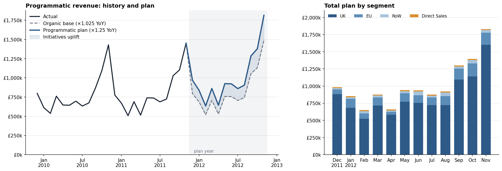

# Annual Revenue Plan by Segment

A portfolio project that builds a 12-month revenue plan by business segment from historical transactions and exports the result to Excel. It is inspired by real-world financial planning workflows in advertising monetisation and uses only public data.



## Result

Plan for Dec 2011 – Nov 2012, GBP:

| | GBP |
|---|---:|
| Previous 12 months (programmatic) | 9,633,408 |
| + organic growth (×1.025) | 241,603 |
| + initiatives uplift (+21.9% on base) | 2,166,749 |
| **Programmatic plan (×1.25 YoY)** | **12,041,760** |
| + Direct Sales | 180,000 |
| **Total plan** | **12,221,760** |

The full monthly plan by segment is in [`output/revenue_plan_2011-12_2012-11.xlsx`](output/revenue_plan_2011-12_2012-11.xlsx).

## Context

I'm a Senior Data Analyst working on advertising monetisation and financial planning. This project reproduces a realistic annual revenue-planning workflow end-to-end on public data so the methodology and code can be shared safely.

## What it does

| Step | Logic |
|---|---|
| Base scenario | For each segment, each plan month starts from that segment's latest complete actual for the same calendar month, preserving seasonality. The actual is grown by organic growth measured in the data. |
| Direct Sales | A manually planned stream added on top of the plan. It is not part of the YoY target. |
| Uplift | The part of the programmatic YoY target that organic growth does not cover is treated as the expected effect of new initiatives and distributed proportionally to the base. |
| Integrity | Rounding residuals are reconciled so segments add up exactly to the plan line. Sanity checks confirm both monthly totals and the YoY target. |
| Export | Creates an Excel workbook with Plan, Assumptions and History sheets, plus a PNG overview chart. |

## Data

[Online Retail II](https://archive.ics.uci.edu/dataset/502/online+retail+ii) from the UCI Machine Learning Repository: about 1M transactions from a UK online retailer, Dec 2009 – Dec 2011, licensed CC BY 4.0.

Countries are grouped into three segments (*UK*, *EU*, *Rest of World*) that stand in for product lines. Revenue is gross, in GBP; cancelled orders and non-product codes (postage, fees, adjustments) are excluded.

The raw file is ~45 MB, so the repo ships only the daily aggregate `data/daily_revenue.csv` (35 KB) and the project runs offline. Delete it to rebuild from the source: the code downloads the data from UCI, or from a public mirror of the original *Online Retail* dataset if UCI is unavailable.

> Citation: Chen, D. (2012). *Online Retail II* [Dataset]. UCI Machine Learning Repository.

## Two ways to view the project

- **[`revenue_plan.ipynb`](revenue_plan.ipynb)** — the walkthrough: each business step with explanations, intermediate tables, the rounding reconciliation and the checks. It is executed, so all outputs are visible on GitHub.
- **[`revenue_plan.py`](revenue_plan.py)** — the planning functions and a one-command run. The notebook imports the same functions and re-does the key steps inline, asserting they match, so the two cannot drift apart.

### Run

```bash
python -m venv .venv
source .venv/bin/activate
pip install -r requirements.txt
python revenue_plan.py
```

Or open `revenue_plan.ipynb` in Jupyter to follow the calculation step by step.

All business inputs are at the top of `revenue_plan.py`: plan start, YoY target, organic growth and the Direct Sales plan.

## Assumptions and limitations

- The YoY target is a business input, not a forecast.
- Organic growth is one rate for all segments and months.
- Automatic organic-growth estimation needs 24 complete months of history; otherwise the base stays flat and a warning is printed.
- The uplift is the same percentage of the base in every month; initiatives do not ramp during the year.
- Direct Sales are a manual input added on top of the programmatic plan.
- Revenue is gross: cancellations are excluded, not subtracted.

## Structure

```
├── revenue_plan.py         # planning functions + one-command run
├── revenue_plan.ipynb      # executed step-by-step walkthrough
├── data/
│   └── daily_revenue.csv   # daily revenue by segment (aggregated from UCI)
├── output/
│   ├── plan_overview.png
│   └── revenue_plan_2011-12_2012-11.xlsx
├── requirements.txt
└── README.md
```

## Tech

Python · pandas · NumPy · matplotlib · XlsxWriter
